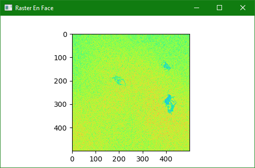
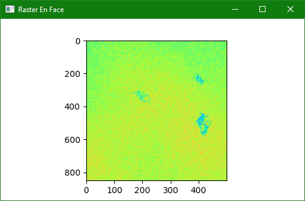
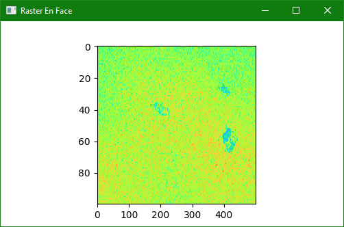

.. _demo/live-view-dynamic:

Live View Dynamic
=================

This demo illustrates how to change fundamental scan parameters on the fly, most notably the scan shape.
When the scan shape is changed, downstream buffers that are used for formatting and displaying the scan must also be resized, but not exactly until the change takes place.
This demo uses the :class:`~vortex.marker.Event` marker to schedule a callback precisely when the new scan shape propagates through *vortex*'s pipeline.
When running the demo, the user can change the scan shape and move the scan center interactively using the keyboard.

.. note::

    The introduction of new markers is planned to reduce the complexity required for scan resizing.

    Initial scan resolution.

    Scan resolution dynamically increased.

    Scan resolution dynamically decreased.

Queueing Callbacks with Events
------------------------------

.. code-block::

        def handle_event(sample, eid):
            handler = self._handlers.pop(eid, None)
            if handler:
                handler(eid)

        self._stack_tensor_endpoint.event_callback = handle_event

        def handle_keypress(e):

            mapping = {
                Qt.Key_Right: ( 0, -1),
                Qt.Key_Left:  ( 0,  1),
                Qt.Key_Up:    ( 1,  0),
                Qt.Key_Down:  (-1,  0),
            }

            if delta := mapping.get(e.key()):
                config = self._raster_scan.config
                config.offset += delta
                self._raster_scan.change(config, False)

                config = self._radial_scan.config
                config.offset += delta
                self._radial_scan.change(config, False)

            if e.key() == Qt.Key_I:
                config = self._raster_scan.config
                config.bscans_per_volume += 50

                def h(eid):
                    tensor = self._stack_tensor_endpoint.tensor
                    with tensor:
                        self._stack_tensor_endpoint.stream.synchronize()
                        orig_shape = tensor.shape
                        shape = orig_shape[:]
                        shape[0] = config.bscans_per_volume
                        tensor.resize(shape)
                        print(eid, tensor.shape)

                eid = self._next_handler_id
                self._next_handler_id += 1
                # print(eid, config.bscans_per_volume)

                self._handlers[eid] = h
                self._raster_scan.change(config, False, eid)

            elif e.key() == Qt.Key_F:
                config = self._raster_scan.config
                config.bscans_per_volume = max([ config.bscans_per_volume - 50, 50 ])

                def h(eid):
                    tensor = self._stack_tensor_endpoint.tensor
                    with tensor:
                        self._stack_tensor_endpoint.stream.synchronize()
                        orig_shape = tensor.shape
                        shape = orig_shape[:]
                        shape[0] = config.bscans_per_volume
                        tensor.resize(shape)
                        print(eid, tensor.shape)

                eid = self._next_handler_id
                self._next_handler_id += 1
                # print(eid, config.bscans_per_volume)

                self._handlers[eid] = h
                self._raster_scan.change(config, False, eid)
