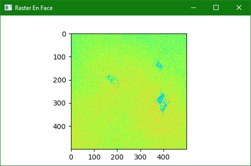
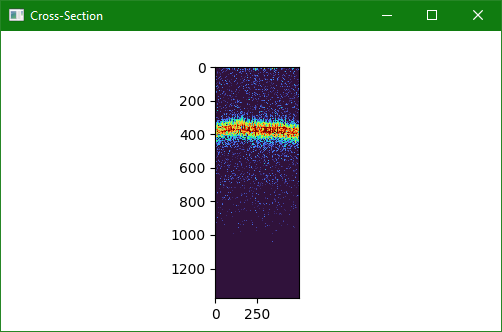

Live View Raster Aim
====================

This demo illustrates how do design a custom scan that interleaves an aiming scan (two perpendicular segments) periodically throughout a raster scan.
Helper classess are used to generate the segments for each scan with different :class:`~vortex.marker.Flags` so that they can be separated in subsequent processing.
See :ref:`how-to/interleave` for a more detailed expalanation of the scan generation.

    Dense raster scan in *en face* view.

    Aiming scan segment in cross-section.

Building an Interleaved Scan
----------------------------

.. code-block::

        pattern = []
        idx = numpy.linspace(0, len(raster_segments), 10, dtype=int)
        for (i, (a, b)) in enumerate(zip(idx[:-1], idx[1:])):
            if i > 0:
                markers = raster_segments[a].markers
                markers.insert(0, VolumeBoundary(0, 0, False))
                markers.insert(0, ScanBoundary(0, 0))

            pattern += raster_segments[a:b]
            pattern += aiming_segments

        ffsc = FreeformScanConfig()
        ffsc.pattern = pattern
        ffsc.loop = True

Separating Segments by Flags
----------------------------

.. code-block::

        fc = FormatPlannerConfig()
        fc.adapt_shape = False

        fc.mask = rsc.flags
        fc.segments_per_volume = rsc.bscans_per_volume
        fc.records_per_segment = rsc.ascans_per_bscan
        raster_format = FormatPlanner(get_logger('format-raster', cfg.log_level))
        raster_format.initialize(fc)
        self._raster_format = raster_format

        fc.mask = asc.flags
        fc.segments_per_volume = asc.bscans_per_volume
        fc.records_per_segment = asc.ascans_per_bscan
        aiming_format = FormatPlanner(get_logger('format-aiming', cfg.log_level))
        aiming_format.initialize(fc)
        self._aiming_format = aiming_format

        # format executors
        cfec = StackFormatExecutorConfig()
        cfec.sample_slice = SimpleSlice(self._process.config.samples_per_ascan // 2)
        samples_to_save = cfec.sample_slice.count()

        sfe = StackFormatExecutor()
        sfe.initialize(cfec)

        raster_tensor_endpoint = StackDeviceTensorEndpoint(sfe, (rsc.bscans_per_volume, rsc.ascans_per_bscan, samples_to_save), get_logger('endpoint-raster', cfg.log_level))
        self._raster_tensor_endpoint = raster_tensor_endpoint

        aiming_tensor_endpoint = StackDeviceTensorEndpoint(sfe, (asc.bscans_per_volume, asc.ascans_per_bscan, samples_to_save), get_logger('endpoint-aiming', cfg.log_level))
        self._aiming_tensor_endpoint = aiming_tensor_endpoint
