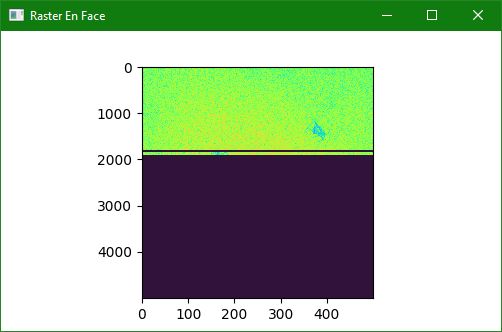
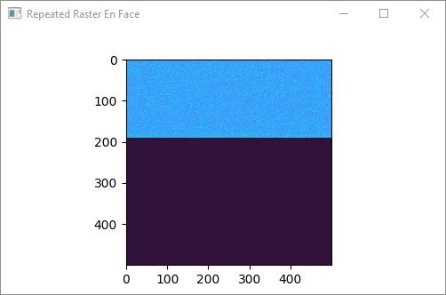

.. _demo/live-view-repeated:

Live View Repeated
==================

This demo illustrates how to perform a repeated scan and display the variance between repetitions on a user interface.
Central to this demo is understanding how :class:`~vortex.scan.RasterRepeatedScan` organizes segments in memory for convenient post-processing.
The variance is incrementally computed as the scan progresses.

    All acquired segments grouped by repetition.
    Note that some segments prior to the leading edge have not yet finished repeating, producing a dark band behind the leading edge.

    Variance of acquired segments.

Incremental Processing of Repeated Scans
----------------------------------------

.. code-block::

    def _update_image(self, endpoint, raw_bscan_idxs):
        with endpoint.tensor as volume:
            endpoint.stream.synchronize()

            updates = {}
            for idx in raw_bscan_idxs:
                # which repeated bscan was updated
                bscan_idx = idx // self._repeat_count
                # which repetition number
                repeat_idx = idx % self._repeat_count

                # accumulate
                updates.setdefault(bscan_idx, []).append(repeat_idx)

            # update appropriate repeated bscans
            for (bscan_idx, repeat_idxs) in updates.items():
                # update based on the most recent repeat
                repeat_idx = max(repeat_idxs)

                # compute index into volume
                start = bscan_idx * self._repeat_count
                end = start + repeat_idx + 1

                # check validity
                if bscan_idx * self._repeat_count + repeat_idx > volume.shape[0]:
                    continue

                # compute variance SVP
                self._image[bscan_idx, ...] = cupy.asnumpy(cupy.max(cupy.std(volume[start:end, ...], axis=0, keepdims=True), axis=2))
