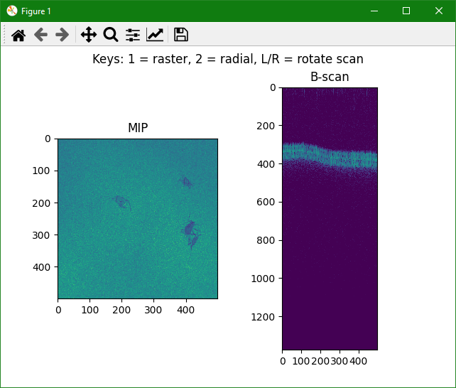

Live View Simple
================

This demo illustrates use of the :class:`~vortex.engine.SimpleEngine` to create an interactive OCT application.
The :class:`~vortex.engine.SimpleEngine` greatly reduces the number of design decisions and configuration options required to get started.

.. note::

    The :class:`~vortex.engine.SimpleEngine` is intended primarily for entry-level users and does not expose the full capabilities of *vortex*.

Keyboard interactivity to switch and modify scans integration is also demonstrated, along with Python logging integration.

.. caution::

    Python logging integration is not recommended for larger application as each log entry requires *vortex*'s background thread to acquire the Global Interpreter Lock.
    This degrades real-time performance and may produce deadlocks.

    Live OCT *en face* and cross-section displayed in a :mod:`matplotlib` window.
