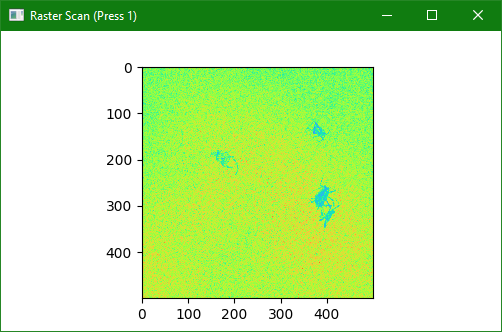
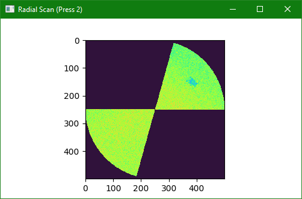

.. _demo/live-view:

Live View
=========

This demo illustrates how to acquire OCT data and display it live on a user interface.
The demo further shows how to switch between different scan types, allowing the user to change between raster and radial scans on demand using the keyboard.

    Raster scan display.

    Radial scan display, interrupted partway through acquisition to resume the raster scan.

Changing Scan Types
-------------------

.. code-block::

    def _handle_keypress(self, e):
        if e.key() == Qt.Key.Key_1:
            print('switch to raster scan')

            # clear volume
            with self._stack_tensor_endpoint.tensor as volume:
                volume[:] = 0
            # invalidate all B-scans
            self._stack_widget.notify_segments(range(self._raster_scan.config.bscans_per_volume))

            self._engine.scan_queue.interrupt(self._raster_scan)

        elif e.key() == Qt.Key.Key_2:
            print('radial to radial scan')

            # clear volume
            with self._radial_tensor_endpoint.tensor as volume:
                volume[:] = 0
            # invalidate all B-scans
            self._radial_widget.notify_segments(range(self._radial_scan.config.bscans_per_volume))

            self._engine.scan_queue.interrupt(self._radial_scan)

        elif e.key() == Qt.Key.Key_Q:
            self._engine.stop()

Configure Radial Scan Formatting
--------------------------------

.. code-block::

        rfec = RadialFormatExecutorConfig()
        rfec.sample_slice = cfec.sample_slice
        rfec.volume_xy_extent = [Range(cfg.scan_dimension, -cfg.scan_dimension), Range(-cfg.scan_dimension, cfg.scan_dimension)]
        rfec.segment_rt_extent = (radial_sc.bscan_extent, radial_sc.volume_extent)
        rfec.radial_segments_per_volume = radial_sc.bscans_per_volume
        rfec.radial_records_per_segment = radial_sc.ascans_per_bscan

        rfe = RadialFormatExecutor()
        rfe.initialize(rfec)
        radial_tensor_endpoint = RadialDeviceTensorEndpoint(rfe, (raster_sc.bscans_per_volume, raster_sc.ascans_per_bscan, samples_to_save), get_logger('radial', cfg.log_level))
        self._radial_tensor_endpoint = radial_tensor_endpoint
