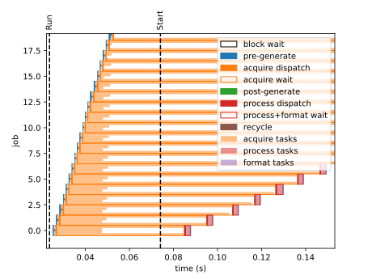

.. _develop/profiler:

Profiler
========

Understanding latency-related issues with the engine is difficult since attaching the debugger alters the real-time performance characteristics.
Similarly, frequent log output itself can induce engine latency that prevents pinpointing of problems.
For this reason, the engine includes a low-overhead profiler to observe the engine retrospectively without affecting its operation.
This functionality is paired with a utility in the ``vortex-tools`` package for parsing and interpreting the profiler output.

Usage
-----

The profiler is activated by setting the environment variable ``VORTEX_PROFILER_LOG`` with a valid path, such as ``log.prof``.
When this variable is present, each session of the *vortex* engine (i.e., each call to :func:`Engine.start() <vortex.engine.Engine.start>`) will write profiler output to the given path, creating intermediate directories as needed.
No code changes are required to activate this functionality.
The profiler is disabled when the ``VORTEX_PROFILER_LOG`` environment variable is absent or empty.

.. caution::

    The profiler will overwrite logs from prior sessions.
    Take care when running multiple sessions.

.. caution::

    Profiler output is written to disk in a background thread.
    Ensure that the session shuts down completely so that all profiling events are recorded.

.. tip::

    To confirm activation of the profiler, check the engine's debug-level log output for messages regarding the opening and closing of the profiler log.

.. _develop/profiler/events:

Events
------

The profiler logs a series of events for each job and task in the engine.
A job refers to the complete passage of block of samples through the pipeline.
A job contains a task for each acquisition, processor, and formatter registered with the engine.
Each job moves through the following stages:

-   ``block wait`` while waiting to enter the pipeline

-   ``pre-generate`` while generating I/O signals (scan pattern and strobes) before acquisition

-   ``acquisition`` while acquiring data and handling I/O signals

-   ``post-generate`` while processing I/O signals (scan position feedback)

-   ``process`` while processing OCT data

-   ``format`` while data is formatted to various endpoints

-   ``recycle`` while buffers are returned and the job is deallocated

For each job, *vortex* records the timestamp associated with the following:

-   ``JOB_CREATE`` when a new job tracking structure is allocated.

-   ``JOB_CLEARANCE`` when a job is released to the engine.
    The engine holds jobs to ensure that no more than :attr:`preload_count <vortex.engine.EngineConfig.preload_count>` jobs are in the acquisition stage concurrently.

-   ``JOB_GENERATE_SCAN`` when scan pattern generation for a job completes.

-   ``JOB_GENERATE_STOBE`` when strobe generation for a job completes.

-   ``JOB_ACQUIRE_DISPATCH_BEGIN`` when the engine begins issuing acquisition tasks for the job.
    These tasks complete in the background.
    This includes any time required to start acquisition hardware at the beginning of the session.

-   ``JOB_ACQUIRE_DISPATCH_END`` when the engine finishes issuing acquisition tasks for the job.
    The engine is now ready to create another job.

-   ``TASK_ACQUIRE_COMPLETE`` when each acquisition task completes in the background.

-   ``JOB_ACQUIRE_JOIN`` when the engine acknowledges that all acquisition tasks for a job have completed.
    It now permits another job to enter the acquisition stage.

-   ``JOB_PROCESS_DISPATCH_BEGIN`` when the engine begins issuing processing tasks for the job.
    These tasks typically complete in the background but can block if resources (e.g., GPU memory) are not ready to initialize the task.

-   ``JOB_PROCESS_DISPATCH_END`` when the engine finishes issuing processing tasks for the job.

-   ``TASK_PROCESS_COMPLETE`` when each processing task completes in the background.

-   ``TASK_FORMAT_BEGIN`` when the engine acknowledges that a processing task has finished.

-   ``TASK_FORMAT_PLAN`` when the engine completes interpretation of the scan pattern markers to create a format plan.
    This involves handling of inactive lines, bidirectional segments, and bidirectional volumes.

-   ``TASK_FORMAT_END`` when all endpoints associated with the format task have completed.

-   ``FORMAT_JOIN`` when the engine acknowledges that all format tasks for a job have completed.

-   ``JOB_RECYCLE`` when job callback returns and job resources are deallocated.

Interpretation
--------------

The ``vortex-tools`` package provides the ``profiler`` module for inspecting and interpreting profiler output.

.. tab:: Windows

    .. code-block:: powershell

        > python -m vortex_tools.profiler -h
        usage: profiler.py [-h] [--count COUNT] [--skip SKIP] [--pretty] [--timeline] [--waterfall] [--statistics] path

        print vortex profiler log

        positional arguments:
        path                  path to profiler log

        options:
        -h, --help            show this help message and exit
        --count COUNT, -c COUNT
                              number of records to show (default: None)
        --skip SKIP, -s SKIP  number of records to skip (default: None)
        --pretty, -p          show pretty output (default: False)
        --timeline, --timing  show profiler timeline (timing) diagram (default: False)
        --waterfall           show profiler waterfall diagram (default: False)
        --statistics, --stats
                              show profiler statistics (default: False)

.. tab:: Linux

    .. code-block:: bash

        $ python3 -m vortex_tools.profiler -h
        usage: profiler.py [-h] [--count COUNT] [--skip SKIP] [--pretty] [--timeline] [--waterfall] [--statistics] path

        print vortex profiler log

        positional arguments:
        path                  path to profiler log

        options:
        -h, --help            show this help message and exit
        --count COUNT, -c COUNT
                              number of records to show (default: None)
        --skip SKIP, -s SKIP  number of records to skip (default: None)
        --pretty, -p          show pretty output (default: False)
        --timeline, --timing  show profiler timeline (timing) diagram (default: False)
        --waterfall           show profiler waterfall diagram (default: False)
        --statistics, --stats
                              show profiler statistics (default: False)

The output consists of a series of records that specific the profiling event, associated task index (e.g., for an acquisition task), the job or block number, and the timestamp in nanoseconds.
The first profiling event indicates the *vortex* and profiler versions in the ``task`` and ``job`` fields, respectively.

.. tab:: Windows

    .. code-block:: powershell

        > python -m vortex_tools.profiler log.prof --pretty --count 10
                                  code  task  job        timestamp
        0             PROFILER_VERSION   403    0                0
        1                ENGINE_LAUNCH     0    0  681110124089600
        2                   ENGINE_RUN     0    0  681110147807500
        3                   JOB_CREATE     0    0  681110149373700
        4                JOB_CLEARANCE     0    0  681110149378900
        5            JOB_GENERATE_SCAN     0    0  681110149919100
        6          JOB_GENERATE_STROBE     0    0  681110150233500
        7   JOB_ACQUIRE_DISPATCH_BEGIN     0    0  681110150344300
        8     JOB_ACQUIRE_DISPATCH_END     0    0  681110150993800
        9                   JOB_CREATE     0    1  681110150997300

.. tab:: Linux

    .. code-block:: bash

        $ python3 -m vortex_tools.profiler log.prof --pretty --count 10
                                  code  task  job        timestamp
        0             PROFILER_VERSION   403    0                0
        1                ENGINE_LAUNCH     0    0  681110124089600
        2                   ENGINE_RUN     0    0  681110147807500
        3                   JOB_CREATE     0    0  681110149373700
        4                JOB_CLEARANCE     0    0  681110149378900
        5            JOB_GENERATE_SCAN     0    0  681110149919100
        6          JOB_GENERATE_STROBE     0    0  681110150233500
        7   JOB_ACQUIRE_DISPATCH_BEGIN     0    0  681110150344300
        8     JOB_ACQUIRE_DISPATCH_END     0    0  681110150993800
        9                   JOB_CREATE     0    1  681110150997300

Plots
+++++

When the ``--timeline`` or ``--waterfall`` flag is passed, the ``profiler`` module generates a timeline derived from the profiler log.
For the ``--waterfall`` flag, each row in the timeline corresponds to one block of samples moving through the engine's pipeline.
For the ``--timeline`` flag, each row in the timeline corresponds to all block of samples moving through a specific stage of the engine's pipeline.
The time that the engine and its components spend in various activities are represented by color-coded bars within each row.
Phases of activity that have multiple tasks contain a smaller color-coded bar for each task.

-   ``block wait`` (black/white) shows the time between ``JOB_CREATE`` and ``JOB_CLEARANCE``.
    This time should be minimal. System resource starvation can increase this time.

-   ``pre-generate`` (blue) shows the time between ``JOB_CLEARANCE`` and ``JOB_ACQUIRE_DISPATCH_BEGIN``.
    Usually this time is minimal. Complex custom scan patterns/warps and a large number of strobes can increase this time.

-   ``acquire dispatch`` (orange) shows the time between ``JOB_ACQUIRE_DISPATCH_BEGIN`` and ``JOB_ACQUIRE_DISPATCH_END``. Usually this time is minimal.
    Malfunctioning hardware can increase this time. For hardware with a blocking API (e.g., NI IMAQdx), the engine uses background threads to shift that time into the task itself.

-   ``acquire wait`` (orange/white) shows the time between ``JOB_ACQUIRE_DISPATCH_END`` and ``JOB_ACQUIRE_JOIN``. This corresponds to the time required to wait for data acquisition to complete.
    Once the engine starts (i.e., after preloading is done), the length of this interval should precisely match the expected time to acquire :attr:`records_per_block <vortex.engine.EngineConfig.records_per_block>`.
    For example, a 100 kHz system with :attr:`records_per_block <vortex.engine.EngineConfig.records_per_block>`\ ``=1000`` and :attr:`records_per_block <vortex.engine.EngineConfig.preload_count>`\ ``=32`` should have an interval of ``32 - 1000 / 100 kHz = 320 ms``.
    If the interval does not match the expected value, the likely cause is an incorrect trigger setting or electrical issues that result in missed or extra triggers.

-   ``acquire task #`` (light orange) shows the time between ``JOB_ACQUIRE_DISPATCH_BEGIN`` and ``TASK_ACQUIRE_COMPLETE`` for each acquisition task.
    Each call to :meth:`add_acquisition(...) <vortex.engine.EngineConfig.add_acquisition>` or :meth:`add_io(...) <vortex.engine.EngineConfig.add_acquisition>` creates a new task, each of which is drawn with a different shade.
    Task ``0`` corresponds to work required by the first call to :meth:`add_acquisition(...) <vortex.engine.EngineConfig.add_acquisition>` or :meth:`add_io(...) <vortex.engine.EngineConfig.add_acquisition>` and so forth.
    This can help identify which acquisition or I/O component is responsible for prolonging the acquisition stage beyond the expected duration above.

-   ``post-generate`` (green) shows the time between ``JOB_ACQUIRE_JOIN`` and ``JOB_PROCESS_DISPATCH_BEGIN``.
    Usually this time is minimal. Complex custom scan warps can increase this time.

-   ``process dispatch`` (red) shows the time between ``JOB_PROCESS_DISPATCH_BEGIN`` and ``JOB_PROCESS_DISPATCH_END``. Usually this time is very small.
    An overloaded GPU (for GPU processors) or CPU (for CPU processors) can increase this time significantly, indicating that the engine has exhausted the available process slots to dispatch the job.
    Recommended actions are to increase :attr:`records_per_block <vortex.engine.EngineConfig.records_per_block>`, which makes dispatching more efficient, or increase the processor's ``slots``, which increases available resources.

-   ``process+format wait`` (red/white) shows the time between ``JOB_PROCESS_DISPATCH_END`` and ``JOB_FORMAT_JOIN``.
    This corresponds to the total time of all processing, formatting, and endpoints for a job.
    If this interval extends beyond when the next acquisition completes (i.e., ``JOB_FORMAT_JOIN`` is after the next ``JOB_ACQUIRE_JOIN``), the engine is processing data slower than it is acquired.
    This will eventually cause the session to abort due to an underflow or overflow.
    Use the process and format tasks to identify which part of the pipeline is responsible for the slowdown.

-   ``process tasks`` (light red) shows the time between ``JOB_PROCESS_DISPATCH_BEGIN`` and ``TASK_PROCESS_COMPLETE`` for each processing task, analogously to acquisition tasks above.
    The time required to perform OCT processing (e.g., filtering, FFT) is reflected here so the interval is usually visible but constant.
    To reduce these intervals, increase :attr:`records_per_block <vortex.engine.EngineConfig.records_per_block>` to improve parallel efficiency, reduce the processor's ``average_window``, reduce the number of samples per A-scan, optimize the process priority/thread affinity (for CPU processors), or upgrade your GPU/CPU.

-   ``format tasks`` (light purple) shows the time between ``TASK_FORMAT_BEGIN`` and ``TASK_FORMAT_END`` for each formatting task, analogously to the acquisition tasks above.
    The time required to handle endpoints is reflected here, including formatting volumes, saving data to disks, executing endpoint callbacks, etc.
    If this time is prolonged, it indicates that the endpoints are consuming data slower than it is acquired. This usually requires optimization of client code (e.g., reducing callbacks, avoiding unnecessary copies, etc.), reducing the scan *en face* resolution, reducing application-specific data post-processing (e.g., volumetric rendering), or using faster hardware for saving (e.g., NVME and/or RAID).

-   ``recycle`` (brown) shows the time between ``JOB_FORMAT_JOIN`` and ``JOB_RECYCLE``.
    Usually this time is minimal.

    Example waterfall timeline derived from the profiler log.

Statistics
++++++++++

When the ``--statistics`` flag is passed, the ``profiler`` module generates a table that lists the interval, rate, duration, and time usage for each task within the engine's pipeline.
In contrast to the above visual displays, this table is suitable for quantitative analysis of the engine's performance.

.. note::

    The number of preloaded blocks can artificially inflate the acquisition duration since blocks are queued far in advance.
    To compensate, the ``profiler`` module attempts to detect the number of preloaded blocks and scales the resulting values by it.
    The output table includes ``P<N>``, where ``<N>`` is the detected number of preloaded blocks, when this compensation is applied.
    This detection may fail for short acquisitions or acquisitions that exit prematurely due to an error.

.. tab:: Windows

    .. code-block:: powershell

        > python -m vortex_tools.profiler log.prof --statistics
        Activity               Samples     Interval (mean +/- std, min - max)         Rate          Duration (mean +/- std, min - max)           Usage        Notes
        -----------------------------------------------------------------------------------------------------------------------------------------------------------
        block wait                5382      1.25 +/-   0.08  [   0.79 -    1.68] ms   ( 800.2 Hz)       1.14 +/-   0.07 [   0.71 -    1.57] ms   (  91.1%)
        pre-generate              5382      1.25 +/-   0.06  [   0.82 -    1.69] ms   ( 800.2 Hz)       0.07 +/-   0.03 [   0.04 -    0.21] ms   (   5.5%)
        acquire dispatch          5382      1.25 +/-   0.08  [   0.79 -    1.68] ms   ( 800.2 Hz)       0.04 +/-   0.01 [   0.03 -    0.18] ms   (   3.3%)
        acquire wait              5382      1.25 +/-   0.08  [   0.79 -    1.68] ms   ( 800.2 Hz)       1.25 +/-   0.00 [   1.23 -    1.26] ms   (  99.7%)    P32
         - acquire task 0         5382      1.25 +/-   0.08  [   0.79 -    1.68] ms   ( 800.2 Hz)       1.25 +/-   0.00 [   1.23 -    1.26] ms   (  99.7%)    P32
         - acquire task 1         5382      1.25 +/-   0.08  [   0.79 -    1.68] ms   ( 800.2 Hz)       0.10 +/-   0.02 [   0.06 -    0.39] ms   (   7.7%)
         - acquire task 2         5382      1.25 +/-   0.08  [   0.79 -    1.68] ms   ( 800.2 Hz)       0.09 +/-   0.02 [   0.05 -    0.26] ms   (   7.0%)
        post-generate             5414      1.25 +/-   0.05  [   0.85 -    1.69] ms   ( 800.2 Hz)       0.02 +/-   0.02 [   0.00 -    0.13] ms   (   1.5%)
        process dispatch          5414      1.25 +/-   0.07  [   0.82 -    1.69] ms   ( 800.2 Hz)       0.06 +/-   0.03 [   0.03 -    0.63] ms   (   4.8%)
        process+format wait       5414      1.25 +/-   0.09  [   0.65 -    1.70] ms   ( 800.2 Hz)       0.98 +/-   0.85 [   0.07 -    5.97] ms   (  78.7%)
         - process task 0         5414      1.25 +/-   0.07  [   0.82 -    1.69] ms   ( 800.2 Hz)       0.26 +/-   0.12 [   0.19 -    2.17] ms   (  20.9%)
         - format task 0          5414      1.25 +/-   0.49  [   0.02 -    5.81] ms   ( 800.2 Hz)       0.57 +/-   0.72 [   0.01 -    5.80] ms   (  46.0%)
        recycle                   5414      1.25 +/-   0.93  [   0.00 -    6.73] ms   ( 800.2 Hz)       0.00 +/-   0.00 [   0.00 -    0.03] ms   (   0.1%)

.. tab:: Linux

    .. code-block:: bash

        $ python3 -m vortex_tools.profiler log.prof --statistics
        Activity               Samples     Interval (mean +/- std, min - max)         Rate          Duration (mean +/- std, min - max)           Usage        Notes
        -----------------------------------------------------------------------------------------------------------------------------------------------------------
        block wait                5382      1.25 +/-   0.08  [   0.79 -    1.68] ms   ( 800.2 Hz)       1.14 +/-   0.07 [   0.71 -    1.57] ms   (  91.1%)
        pre-generate              5382      1.25 +/-   0.06  [   0.82 -    1.69] ms   ( 800.2 Hz)       0.07 +/-   0.03 [   0.04 -    0.21] ms   (   5.5%)
        acquire dispatch          5382      1.25 +/-   0.08  [   0.79 -    1.68] ms   ( 800.2 Hz)       0.04 +/-   0.01 [   0.03 -    0.18] ms   (   3.3%)
        acquire wait              5382      1.25 +/-   0.08  [   0.79 -    1.68] ms   ( 800.2 Hz)       1.25 +/-   0.00 [   1.23 -    1.26] ms   (  99.7%)    P32
         - acquire task 0         5382      1.25 +/-   0.08  [   0.79 -    1.68] ms   ( 800.2 Hz)       1.25 +/-   0.00 [   1.23 -    1.26] ms   (  99.7%)    P32
         - acquire task 1         5382      1.25 +/-   0.08  [   0.79 -    1.68] ms   ( 800.2 Hz)       0.10 +/-   0.02 [   0.06 -    0.39] ms   (   7.7%)
         - acquire task 2         5382      1.25 +/-   0.08  [   0.79 -    1.68] ms   ( 800.2 Hz)       0.09 +/-   0.02 [   0.05 -    0.26] ms   (   7.0%)
        post-generate             5414      1.25 +/-   0.05  [   0.85 -    1.69] ms   ( 800.2 Hz)       0.02 +/-   0.02 [   0.00 -    0.13] ms   (   1.5%)
        process dispatch          5414      1.25 +/-   0.07  [   0.82 -    1.69] ms   ( 800.2 Hz)       0.06 +/-   0.03 [   0.03 -    0.63] ms   (   4.8%)
        process+format wait       5414      1.25 +/-   0.09  [   0.65 -    1.70] ms   ( 800.2 Hz)       0.98 +/-   0.85 [   0.07 -    5.97] ms   (  78.7%)
         - process task 0         5414      1.25 +/-   0.07  [   0.82 -    1.69] ms   ( 800.2 Hz)       0.26 +/-   0.12 [   0.19 -    2.17] ms   (  20.9%)
         - format task 0          5414      1.25 +/-   0.49  [   0.02 -    5.81] ms   ( 800.2 Hz)       0.57 +/-   0.72 [   0.01 -    5.80] ms   (  46.0%)
        recycle                   5414      1.25 +/-   0.93  [   0.00 -    6.73] ms   ( 800.2 Hz)       0.00 +/-   0.00 [   0.00 -    0.03] ms   (   0.1%)

Diagnostics
-----------

The profiler can be used to identify configuration and electrical issues.

-   **Incorrect Triggering**:
    In the statistics table, the acquire dispatch rate does not match the expected value for the source or the acquire tasks have different rates.
    In the waterfall plot, lines drawn through completion events of acquisitions tasks do not remain parallel after the session start.
    This suggests that the hardware components are triggering at different rates.

-   **Insufficient Preload**:
    Random jitter in acquisition dispatch times is not much larger than the acquisition wait interval.
    The engine is likely to underflow the acquisition buffers when the computer is highly loaded.

-   **Insufficient Block Size**:
    The engine spends more time dispatching tasks than waiting for tasks to complete.
    This suggests that the overhead of setting up a block is too high so the block size should be increased.

-   **Excessive Processing**:
    In the statistics table, the processing rate is smaller than the acquire dispatch rate.
    In the waterfall plot, a line drawn through completion events of recycling tasks has a smaller slope than the line drawn through acquisition tasks.
    This suggests that the processing pipeline is not returning blocks to the engine sufficiently fast to maintain the acquisition indefinitely.
