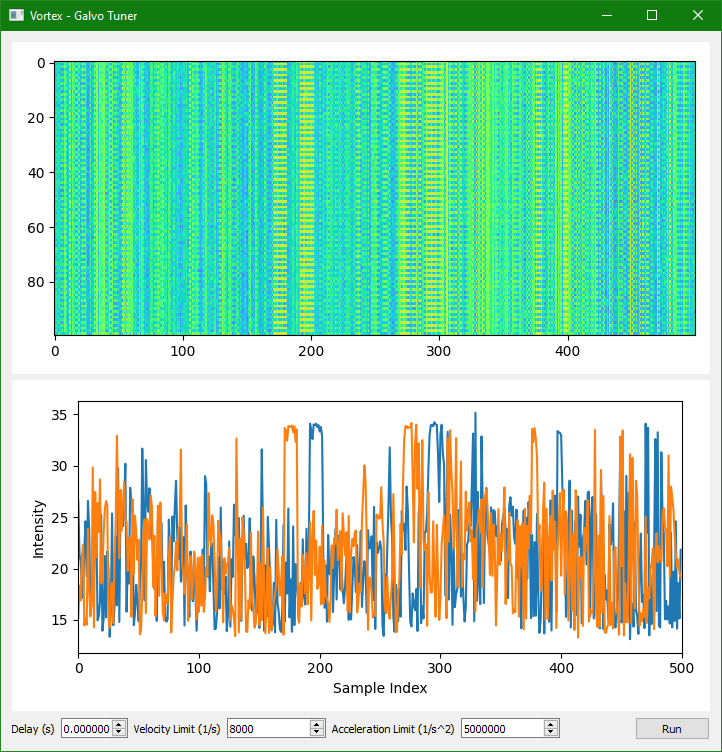
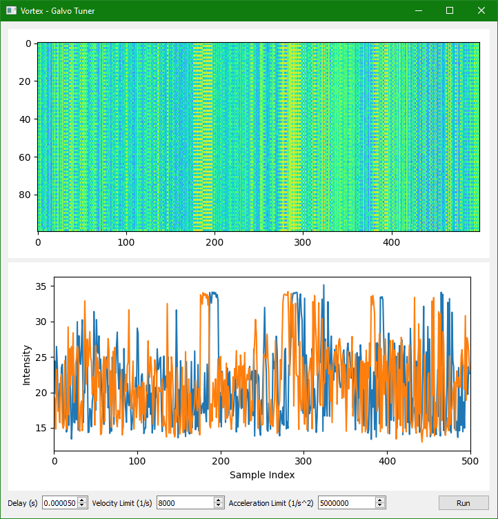
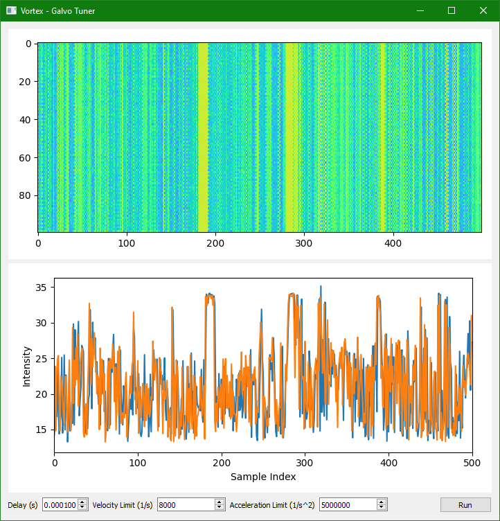

.. _how-to/io-delay:

Correct IO Delay
================

*vortex* facilitates correction of IO delay through scan pattern lookahead.
When added to the engine, each IO component is associated with its number of lookahead samples through the ``lead_samples`` argument of :meth:`EngineConfig.add_io() <vortex.engine.EngineConfig.add_io>`, which defaults to ``0`` if not specified.
*vortex* will then drive the IO component with scan waveforms that are time-shifted by that number of samples into the future, thereby canceling out IO delay.
The :ref:`Python demo engine <demos>` exposes this capability through the ``galvo_delay`` configuration parameter.

Tuning Delay
------------

*vortex* provides a galvo tuning demo at `demo/galvo_tuner.py <https://gitlab.com/vortex-oct/vortex/-/blob/develop/demo/galvo_tuner.py>`_ which can help determine the best value of ``lead_samples`` without needing to digitize scan waveforms.
The approach is to take bidirectional repeated B-scans and adjust ``lead_samples`` until features in the forward and backwards sweep align.
The galvo tuner shows the *en face* projection of the repeated B-scan stack, each of which alternates directions, and the *en face* average for each direction.
The galvo delay spinbox is adjusted until the best alignment is achieved, as shown below.

    Initial galvo delay of 0 ms.

    Partial improvement with galvo delay of 50 ms.

    Best alignment with galvo delay of 100 ms.

This last screenshot shows the best overlap that could be obtained for this system.
The optimal galvo delay is therefore 100 ms.
Note that the resolution of ``lead_samples`` in time is determined by the trigger rate.

Tuning Dynamics Limits
----------------------

The galvo tuner also allows adjustment of scan velocity and acceleration limits which affect scan alignment and distortion.
This is especially so for excessively high acceleration limits.
Tuning of dynamic limits is best done with a target that has a regularly spaced pattern.

#.  Start by entering the maximum velocity for your galvanometers, as determined from the driver slew rate limit or datasheet.

#.  Tune the acceleration setting.

    -   If the pattern appears regular, increase the acceleration limit until distortion is observed.
        Set your acceleration limit slightly below the value at which distortion is observed.

    -   If the pattern appears distorted on the ends, decrease the acceleration limit until the distortion disappears.
        Set your acceleration limit slightly below the value at which distortion resolves.

#.  Tune the velocity setting slightly to see if any residual distortion resolves.

Best results for tuning dynamics limits are obtained by recording the galvo position feedback and comparing to the drive waveforms, which is beyond the scope of this demo.
